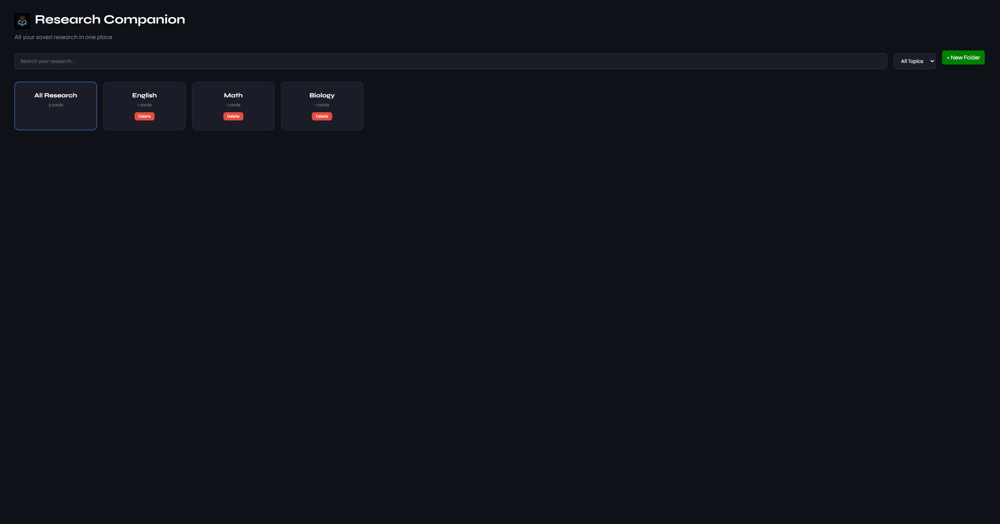
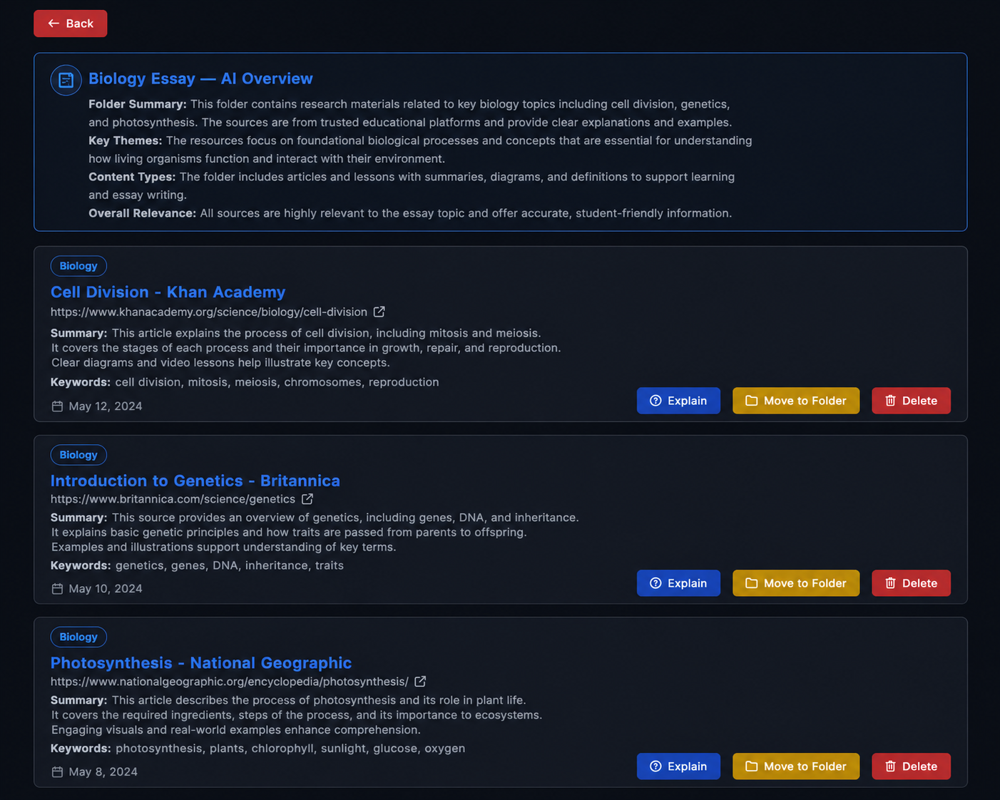
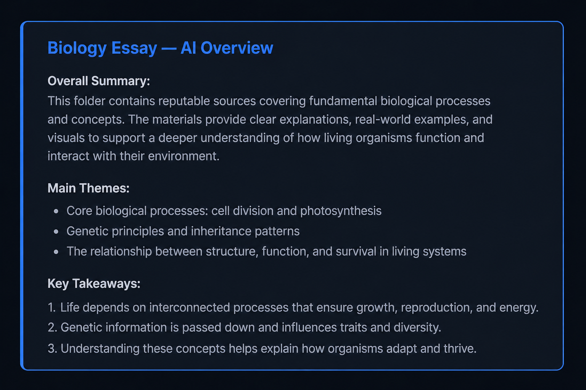
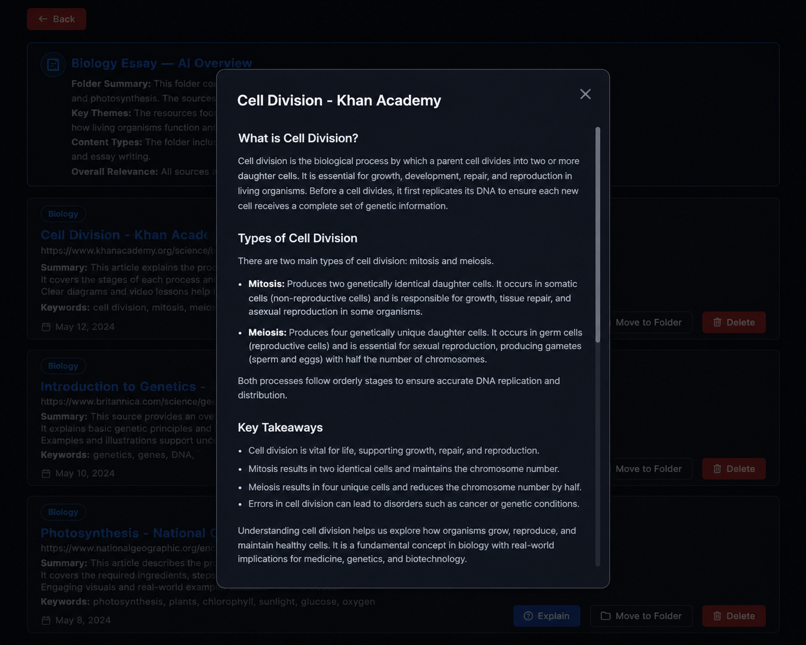
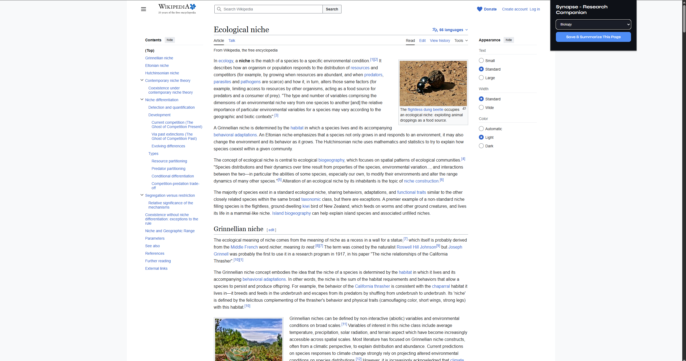

# Synapse — Research Companion

An AI-powered Chrome extension that summarizes, organizes, and explains any webpage you visit. Save research in one click, organize it into folders, and get AI-generated overviews of your research collections.

## 🌐 Live Dashboard
[Open Dashboard](https://ayanshv.github.io/Research-Companion/)

##  Why I Built This
I wanted to build something that solves a real problem I face as a student, losing track of sources and research while working on essays and projects. I also wanted to explore a completely new tech stack, learning JavaScript, Chrome extension development, Flask APIs, and SQLite databases all in one project. The goal was to build something any student could open in their browser and immediately get value from, no technical knowledge required.

##  Features
- **Instant AI Summaries** — get a clean 3-5 sentence summary of any webpage in one click
- **Keyword Extraction** — key terms pulled automatically from every page
- **Smart Folders** — organize research into custom folders for different projects or essays
- **Folder AI Overview** — get an AI-generated summary of everything inside a folder when you open it
- **Explain Further** — dive deeper into any saved page with a detailed AI explanation
- **Full Dashboard** — view, search, filter, and manage all your saved research in one place
- **Delete Cards and Folders** — keep your research clean and organized
- **Works on any website** — news articles, Wikipedia, academic papers, blogs, anything

## 📸 Screenshots

### Home — Folder Grid


### Inside a Folder


### AI Folder Summary


### Explain Further Modal


### Chrome Extension Popup


## Tech Stack
- **Chrome Extension** — JavaScript, Chrome APIs
- **Backend API** — Python, Flask, Flask-CORS
- **AI Summarization** — Google Gemini API
- **Database** — SQLite
- **Dashboard** — HTML, CSS, JavaScript
- **Deployment** — Railway (backend), GitHub Pages (dashboard)

##  How to Run Locally

### Backend
1. Clone the repo
```bash
git clone https://github.com/ayanshv/Research-Companion.git
```
2. Install dependencies
```bash
pip install -r requirements.txt
```
3. Add your Gemini API key to a `.env` file
GEMINI_API_KEY=your_key_here
4. Run the backend
```bash
python backend/app.py
```

### Chrome Extension
1. Open Chrome and go to `chrome://extensions`
2. Enable Developer Mode
3. Click "Load unpacked" and select the `extension` folder
4. The extension will appear in your toolbar

### Dashboard
Open `dashboard/index.html` in your browser or visit the live link above.

##  Project Structure

| File | Description |
|---|---|
| **`extension/manifest.json`** | Chrome extension config |
| **`extension/popup.html`** | Extension popup UI |
| **`extension/popup.js`** | Popup logic and onboarding |
| **`extension/content.js`** | Reads webpage content |
| **`backend/app.py`** | Flask API routes |
| **`backend/database.py`** | SQLite database logic |
| **`backend/summarizer.py`** | Gemini AI integration |
| **`dashboard/index.html`** | Dashboard UI |
| **`dashboard/style.css`** | Styling |
| **`dashboard/script.js`** | Dashboard logic |
| **`dashboard/config.js`** | Button customization |
| **`docs/`** | GitHub Pages deployment |
| **`requirements.txt`** | Python dependencies |
| **`Procfile`** | Railway deployment config |